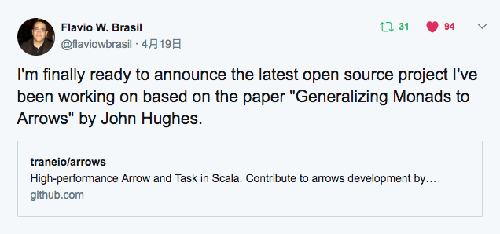
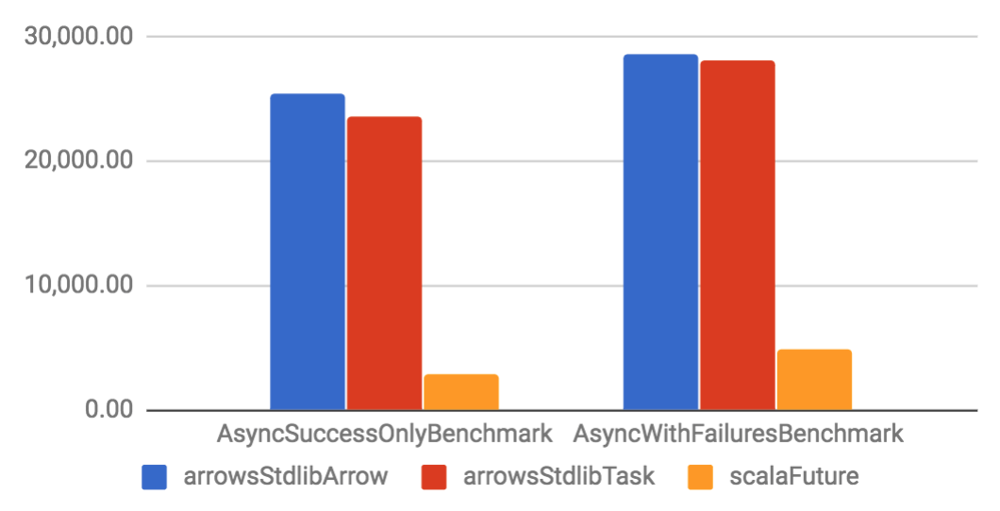
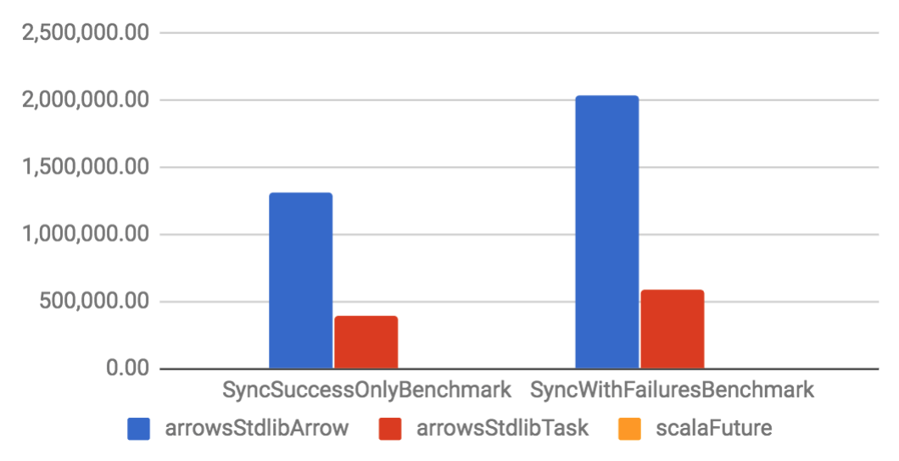
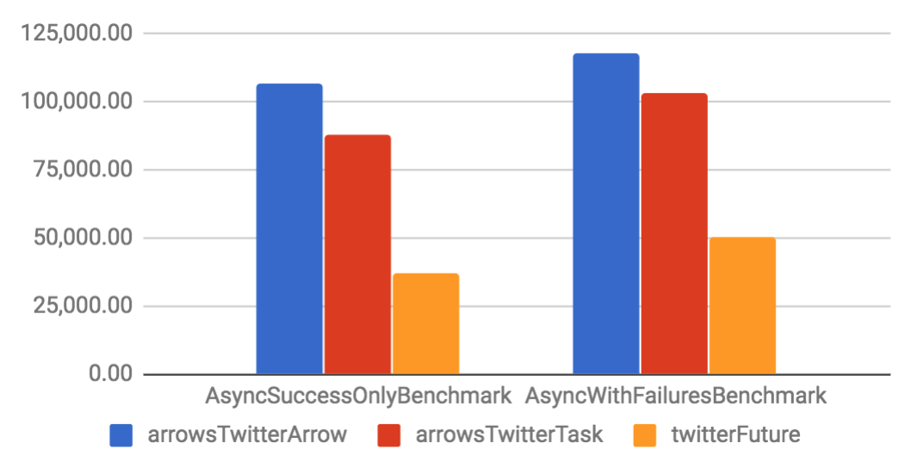
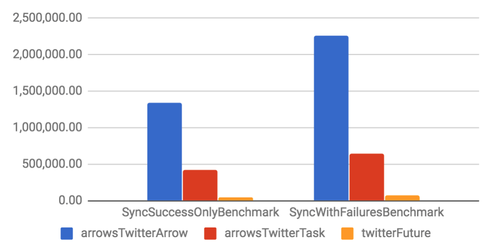
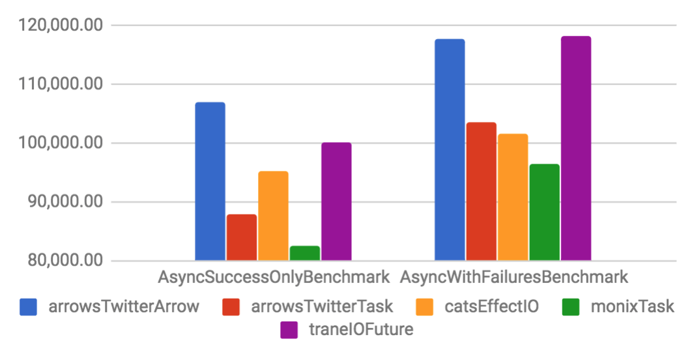
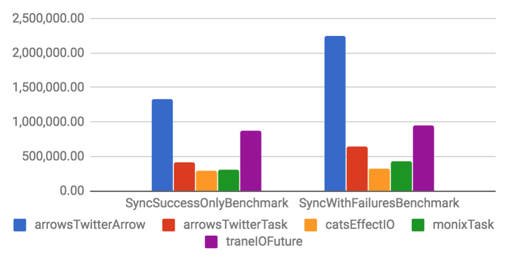

# Arrows

F@N Communications, Inc.

石川 裕樹 (Yuki Ishikawa)

---

## 自己紹介

### 石川 裕樹 (Yuki Ishikawa)

- ファンコミ入社4年目

- nend, nex8, viidleの配信システムをScalaで開発

- ScalaCache, sttp, refinedとかのメンテナンス

- バイク好き🏍

- Twitter: @rider_yi

- GitHub: rider-yi

---

## traneio/arrows

- https://github.com/traneio/arrows

- 4月19日に正式公開されたばかりのライブラリ




## Arrows

- 高パフォーマンスなArrowとTask
- Arrow & Task = 再利用可能な計算を表す型
- Futureから移行しやすい

---

## 実装が2種類ある

基本的にどちらか1つを選択して使う

- arrows-stdlib
- arrows-twitter


## arrows-stdlib

`scala.concurrent.Future`をベースにしている

```scala
libraryDependencies ++= Seq(
  "io.trane" %% "arrows-stdlib" % "0.1.19"
)
```

```scala
import arrows.stdlib._
```


## arrows-twitter

twitter/utilの`Future`をベースにしている

(finch, Finagleユーザ向け)

```scala
libraryDependencies ++= Seq(
  "io.trane" %% "arrows-twitter" % "0.1.19"
)
```

```scala
import arrows.twitter._
```


- ベースとしている`Future`が違う
- 移行しやすいようにI/Fが合わせてある

```scala
import scala.concurrent.Future
import arrows.stdlib._

// Scala Future
Future.successful("foo")
Task.successful("foo")

Future.failed(new Exception)
Task.failed(new Exception)
```

<!-- .element: class="fragment" -->

```scala
import com.twitter.util.Future
import arrows.twitter._

// Twitter Future
Future.value("foo")
Task.value("foo")

Future.exception(new Exception)
Task.exception(new Exception)
```

<!-- .element: class="fragment" -->

Note:
- join, collectなど他のメソッドもあります


使っているライブラリやフレームワークに合わせて選ぶと良い

---

## Arrow[T, U]

- <!-- .element: class="fragment" --> 引数を1つ取り1つ値を返す計算
- <!-- .element: class="fragment" --> runするまで計算は行われない(lazy)
- <!-- .element: class="fragment" --> andThenで結合可能


### Arrowの作り方

```scala
import arrows.twitter._

// Identity arrowは受け取った値を返すだけ
val identityArrow: Arrow[Int, Int] = Arrow[Int]
```

<!-- .element: class="fragment" -->

```scala
val stringify: Arrow[Int, String]
  = Arrow[Int].map(_.toString)
```

<!-- .element: class="fragment" -->

Note:
- Arrow.applyとmapを使うことで`Arrow`の計算を定義できる
- Identity arrowはそのままでは役に立たないが、新しいArrowを作るためのスターティングポイントとして役に立つ


### Arrowの実行

```scala
val stringify: Arrow[Int, String]
  = Arrow[Int].map(_.toString)

// runするとFutureを返す
val fut1: Future[String] = stringify.run(123)
```

<!-- .element: class="fragment" -->

```scala
// Arrowはただの計算なので再利用が可能
val fut2: Future[String] = stringify.run(321)
```

<!-- .element: class="fragment" -->


### andThenでArrow同士を結合

```scala
val callServiceA: Arrow[Int, Int] = Arrow[Int].map(_ + 1)
val callServiceB: Arrow[Int, Int] = Arrow[Int].map(_ * 2)
val callServiceC: Arrow[Int, Int] = Arrow[Int].map(_ - 1)
```

```scala
val myArrow: Arrow[Int, Unit] =
  callServiceA
    .andThen(callServiceB)
    .andThen(callServiceC)

val fut = myArrow.run(5)
Await.result(fut) // 11
```

Note:
- flatMapの説明をする前にもう一つの`Task`という型を紹介したいと思います

---

## Task[T]

- <!-- .element: class="fragment" --> cats-effect, Scalaz, Monixなどの`IO`,`Task`と同等
- <!-- .element: class="fragment" --> 値を1つ返す計算
- <!-- .element: class="fragment" --> 入力値のないArrow


### TaskはArrowの型エイリアス

```scala
package arrows

package object twitter {
  type Task[+T] = Arrow[Unit, T]
}
```


### Taskの作り方

```scala
import arrows.twitter._

val random: Task[Int] = Task {
  scala.util.Random.nextInt(100)
}

val fut: Future[Int] = random.run()
```

<!-- .element: class="fragment" -->

```scala
// 既に計算された値にはvalueを使う
val one = Task.value(1)
```

<!-- .element: class="fragment" -->

Note:
- catsのpure(Applicative)とdelay(Sync)


### Async

```scala
def performSomeAsyncSideEffect: Future[Unit] = ???

Task.async(performSomeAsyncSideEffect())
```

<!-- .element: class="fragment" -->

- cats-effectのAsyncと違って`f: => Future[T]`を引数に取る

<!-- .element: class="fragment" -->

```scala
// Bad practice
val fut = performSomeAsyncSideEffect()
Task.async(fut)
```

<!-- .element: class="fragment" -->

Note:
- asyncはcall-by-nameでパラメータを受け取るので、実際にはperformSomeAsyncSideEffectは評価されない

---

### flatMap

```scala
final def flatMap[V](f: U => Task[V]): Arrow[T, V] =
  this match {
    case a: Exception[_] => a.cast
    case a               => FlatMap(a, f)
  }
```

- ArrowのflatMapは`U => Task[V]`を引数に取る
- TaskはMonadだけどArrowはMonadではない


### 処理の分岐などに使用

```scala
import arrows.twitter._

val callServiceA = Arrow[Int].map(_ * 2)
val callServiceB = Arrow[Int].map(_ + 1)

val myArrow =
  callServiceA.flatMap {
     case 0 => Task.value(0)
     case i => callServiceB(i) // Arrowに値を与えるとTaskになる
  }

val result: Future[Int] = myArrow.run(1)
```


### for comprehension

```scala
val taskA: Task[Int] = Task.value(1)
val taskB: Task[Int] = Task.value(2)
val taskC: Task[Int] = Task.value(3)

val myTask: Task[Int] = 
  for {
    a <- taskA
    b <- taskB
    c <- taskC
  } yield a + b + c
```


```scala
val callServiceA: Arrow[Int, Int] = Arrow[Int].map(_ + 1)
val callServiceB: Arrow[Int, Int] = Arrow[Int].map(_ * 2)
val callServiceC: Arrow[Int, Int] = Arrow[Int].map(_ - 1)

val myArrow: Arrow[Int, Int] =
  for {
    a <- callServiceA
    b <- callServiceB(a)
    c <- callServiceC(b)
  } yield c
```

```
// andThenの方が処理効率が良い
callServiceA
  .andThen(callServiceB)
  .andThen(callServiceC)
```

---

## Arrow vs Task

```scala
val myArrow = arrow.andThen(arrow).andThen(arrow)
```

<!-- .element: class="fragment" -->

```scala
val myArrow = for {
  a <- arrow
  b <- arrow(a)
  c <- arrow(b)
} yield c
```

<!-- .element: class="fragment" -->

```scala
private def task(x: Int): Task[Int] = Task { x + 1 }

private def taskFor(x: Int): Task[Int] =
  for {
    a <- task(x)
    b <- task(a)
    c <- task(b)
  } yield c
```

<!-- .element: class="fragment" -->


```
                Mode  Cnt         Score         Error  Units
benchAndThen   thrpt    3  27916962.060 ± 5166918.793  ops/s
benchArrowFor  thrpt    3  12747120.128 ± 4454238.242  ops/s
benchTaskFor   thrpt    3   9832552.072 ± 2459368.235  ops/s
```

https://gist.github.com/rider-yi/7741533126f522bc931cfaaaf7f3ddfe

---

## Arrows vs Future


### Scala Future x Arrows Stdlib (Async)

#### Throughput (ops/s)



Note:
- arrow: 25,385
- scala: 2,817


### Scala Future x Arrows Stdlib (Sync)

#### Throughput (ops/s)



Note:
- arrow: 1,306,246
- scala: 9,804


### Twitter Future x Arrows Twitter (Async)

#### Throughput (ops/s)




### Twitter Future x Arrows Twitter (Sync)

#### Throughput (ops/s)



---

### Arrows vs Other libraries


## Other libraries x Arrows (Async)

#### Throughput (ops/s)




### Other libraries x Arrows (Sync)

#### Throughput (ops/s)




- Arrowは他のライブラリより高パフォーマンス
- Taskはちょっとだけ良い

---

## `Future`からの移行

- `Future`と`Task`はI/Fが似ているのでとりあえず全部Task化
  - READMEにScalafixのルールがある

- 後で可能な部分は全てArrow化する

```scala
def callService(x: Int): Task[Unit] = Task { ... }
// ↓
val callService: Arrow[Int, Unit] = Arrow[Int].map { ... }
```

- See: https://github.com/traneio/arrows#migrating-from-future

---

## cats-effect integration

- 現状ない😢
- サブモジュールで提供予定らしい(現在開発中?)
- MonadError, Syncくらいなら簡単につくれる

---

## ありがとうございました

- https://rider-yi.github.io/Fancs-Scala-Study-Group-Vol2/
